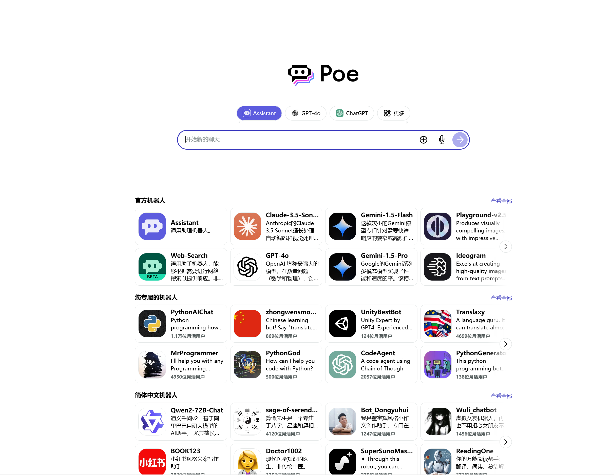
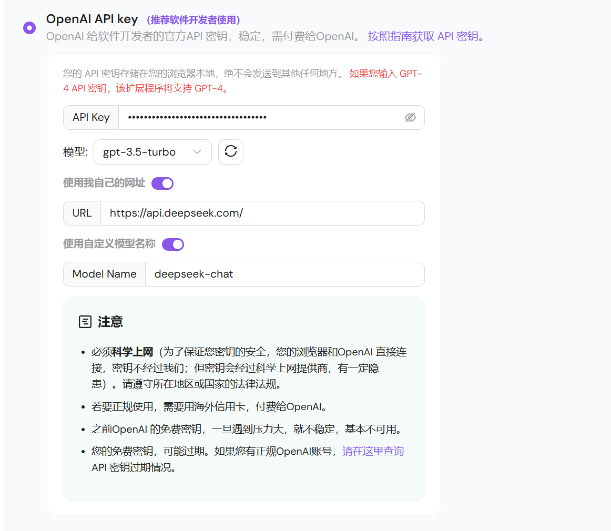
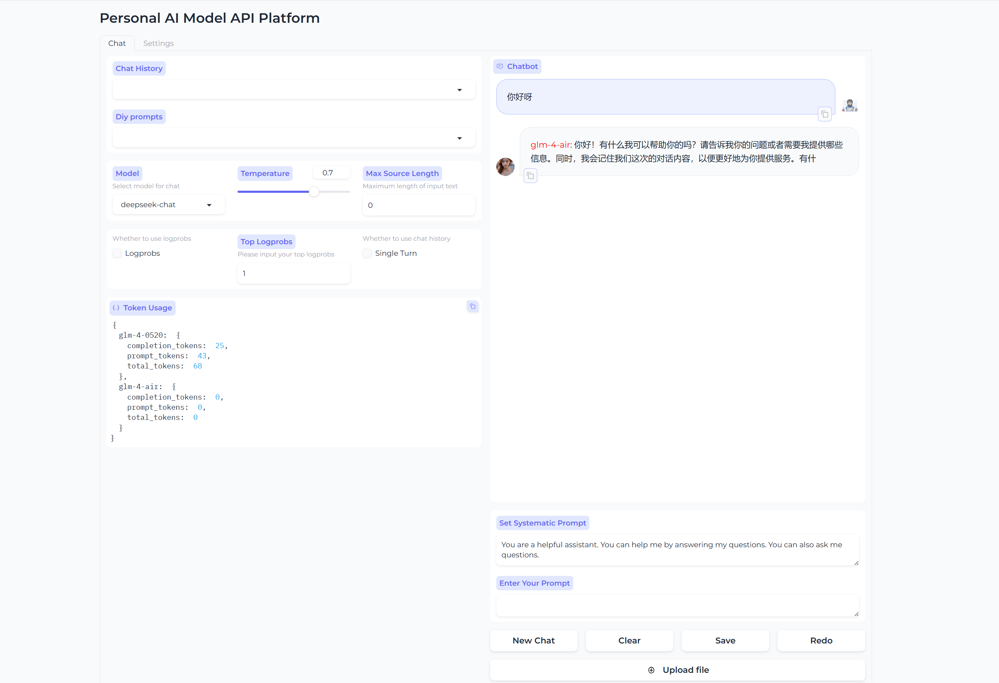

# CustomPoe
- 一个能支持多个来自不同产商的模型的对话机器人平台
- A chatbot platform that can support multiple models from different manufacturers。

如果您是一个像我一样爱好使用大模型的人，您一定会有想要一个能支持多个模型，并且能在不同模型之间切换的平台。许多人选择了poe，然而poe具有以下缺点：
- 收费太贵
- 功能死板，无法自己定制
- 有些自己想要使用的模型无法在poe上使用，比如deepseek-chat等模型
- 对话时无法在模型之间切换

也有许多人选择了插件和各种应用程序，然而插件有以下缺点：
- 插件只能配置一个api，比如我使用了deepseek的api就无法使用glm的api
- 插件的小bug只能忍受不能修改

我正是由于以上苦恼，自己写了一个平台，功能简单，仅供参考。本平台支持以下功能:
- 支持历史记录
- 支持上传文件
- 支持记录token使用
- 支持自定义sys prompt
- 支持切换模型
- 支持多个模型配置
  

